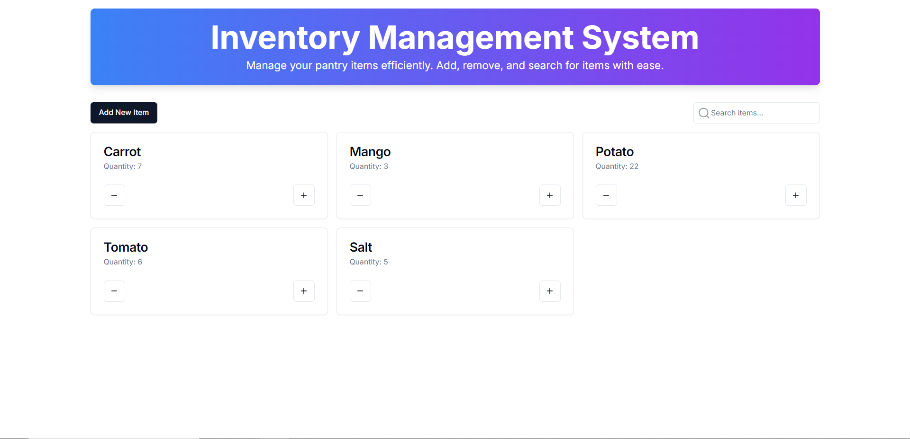
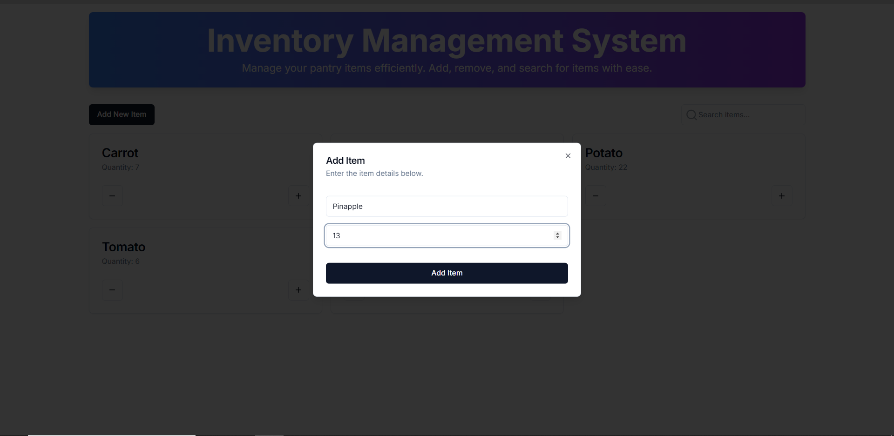

# Inventory Management System

  ## Overview
  - The Inventory Management System is a web-based application designed to streamline the process of managing inventory within [Company Name]. It allows users to efficiently add, delete, update, and monitor items in the inventory, ensuring that stock levels are maintained and accurate records are kept. Built with modern web technologies, this system provides a user-friendly interface and robust backend support.

  ## Features
  - Add Items: Easily add new items to the inventory, complete with details such as item name, description, quantity, and price.
  - Delete Items: Remove items from the inventory when they are no longer needed or have been sold out.
  - Update Items: Modify existing item details, such as adjusting quantities, changing descriptions, or updating prices.
  - Inventory Tracking: Keep track of stock levels and receive alerts when items are low or out of stock.
  - Search and Filter: Quickly find items using search and filter functionalities

  ## Tech Stack
  - Frontend: Next.js, React for building a responsive and interactive user interface.
  - Backend: Node.js and Express for handling server-side logic and API requests.
  - Database: Firebase or PostgreSQL for storing and managing inventory data securely.
  - Authentication: Firebase Authentication for managing user login and access control.
  ## Demo
  
  
