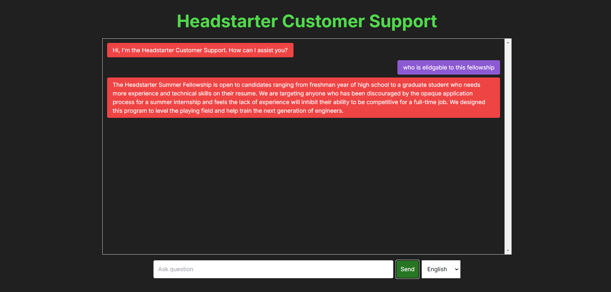

# Headstarter AI Chatbot
  ## Overview
  - The Headstarter AI Chatbot is a custom-built AI-powered conversational assistant designed to enhance customer engagement and support for Headstarter. Leveraging advanced natural         language processing through the OpenAI API, this chatbot is capable of understanding and responding to user queries with accuracy and efficiency. Integrated within the company's website or application, the chatbot serves as a 24/7 support agent, providing quick and helpful responses to customer inquiries.
  
  ## Features
  - Natural Language Understanding: The chatbot uses OpenAI's GPT model to comprehend and respond to customer queries in a natural and conversational manner.
  - Multi-Language Support: Understands and responds in Spanish, french, and English.    - Custom Responses: Tailored to the specific needs of [Company Name], the chatbot provides answers that align with the company's products, services, and brand voice.
  - 24/7 Availability: Ensures continuous support for customers, improving user experience and satisfaction.

  ## Tech Stack
   - Frontend: Next.js, React
  - Backend: Firebase for real-time data storage and user management
  - AI Integration: OpenAI API for natural language processing
    - Deployment: Hosted on Vercel
  ## Demo
  
